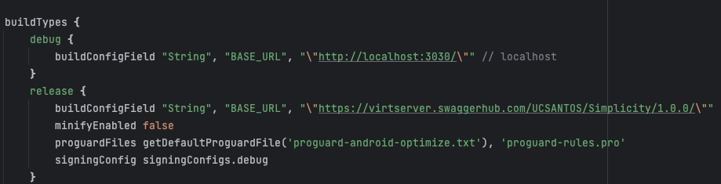

# simplicity_mobile

## Installation

### Downloading Android Studio
get started with Simplicity, you'll need to download and install Android Studio. You can download the latest version from the official Android Developers website.

## How to run application on your mobile device

Follow these steps:

#### Enable USB Debugging on Your Android Device:

1. On your Android device, navigate to Settings.
2. Scroll down and select "Developer options".
3. Find the "USB debugging" option and enable it.

#### Connect Your Android Device to Your Computer:

- Use a USB cable to connect your Android device to your computer.

#### Setting Up Port Forwarding (for Localhost API):

You need to set up port forwarding using ADB (Android Debug Bridge) to connect Android device to Android Studio.
- Command to install adb (For Macbook): brew install android-platform-tools
- Command to run adb port forward: adb reverse tcp:3030 tcp:3030

#### Run Your App in Android Studio:

1. Open your project in Android Studio.
2. Click on the "Run" button (the green triangle icon) or select "Run" > "Run 'app'" from the menu.
3. Android Studio will detect your connected device and install the app on it. If prompted on your device, allow USB debugging.

## Procedure of Changing IP via Gradle File:

1. **To update deployed IP in build.gradle file:** Locate build.gradle file: app/src/build.gradle, replace https://virtserver.swaggerhub.com/UCSANTOS/Simplicity/1.0.0/ with deployed IP(per below screenshot)

2. **Select Build Variant:** Locate it in the left toolbar.

3. **Choose Variant:** Switch to either "release" mode or "debug" mode, whichever is applicable.

4. **Sync Project with Gradle Files:** Locate the "elephant-like" icon on the toolbar at the top right and click on it.

5. **Run App:** Click on the "Run" button in the toolbar at the top right.
